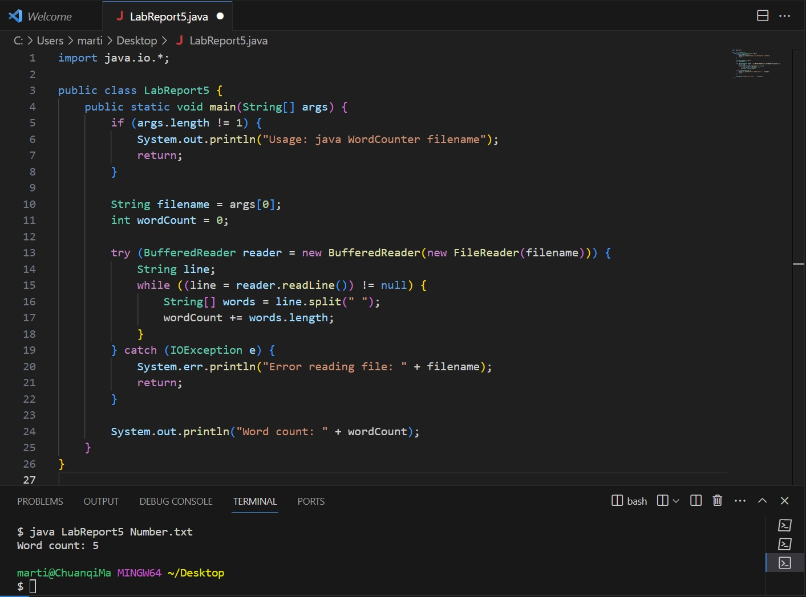

# Lab Report4 Vim(Week7)

## Part 1 – Debugging Scenario

Design a debugging scenario, and write your report as a conversation on EdStem. It should have:


### 1. The original post from a student with a screenshot showing a symptom and a description of a guess at the bug/some sense of what the failure-inducing input is. (Don’t actually make the post! Just write the content that would go in such a post)
#### Original Student Post
***Title:*** Problem with the Java Program WordCounter: Inaccurate Word Count


***Content:*** Hi guys, I'm developing a Java program that can automatically count words, this program should count the number of characters in a file. However, I got a higher word count than expected. The following screenshot is what I got. I think this program may not handle spaces well. A calculation error occurs once I enter multiple spaces.

.jpg)



### 2. A response from a TA asking a leading question or suggesting a command to try (To be clear, you are mimicking a TA here.)

#### TA's Response
***Title:*** Reply: Word count error in the Java Program WordCounter.


***Content:***  Hi there! It seems that the way your program divides lines into words may actually be connected to the issue. Do you take into consideration various kinds of whitespace characters in your reasoning? To handle multiple spaces and tabs, try modifying the line splitting code and observe the output that results. Try it out now!


### 3. Another screenshot/terminal output showing what information the student got from trying that, and a clear description of what the bug is.

#### Follow-up Student Post
***Title:*** Modified the splitting logic in the code


***Content:*** I followed your suggestion and modified the splitting logic to help solve this problem. Below is a screenshot after I modified it. The word count within the document is now correct! Thanks for your advice!

.jpg)


### 4. At the end, all the information needed about the setup including:

**At the end, all the information needed about the setup including:**
  
* The file & directory structure needed
  >~/Desktop
  
  >LabReports5.java
  


* The contents of each file before fixing the bug

```
import java.io.*;

public class LabReport5 {
    public static void main(String[] args) {
        if (args.length != 1) {
            System.out.println("Usage: java WordCounter filename");
            return;
        }

        String filename = args[0];
        int wordCount = 0;

        try (BufferedReader reader = new BufferedReader(new FileReader(filename))) {
            String line;
            while ((line = reader.readLine()) != null) {
                String[] words = line.split(" ");
                wordCount += words.length;
            }
        } catch (IOException e) {
            System.err.println("Error reading file: " + filename);
            return;
        }

        System.out.println("Word count: " + wordCount);
    }
}
```

* The contents of count.sh

```
javac LabReport5.java
java LabReport5 $1
  ```

* The contents of Number.txt
  
```
this  is a test
```

* The full command line (or lines) you ran to trigger the bug

```
String[] words = line.split("\\s+");
```
  
* A description of what to edit to fix the bug

In the code, `String[] words = line.split(" ");` this command is the cause of the error. Here I should add `"\\s+";` ;The modified code is `String[] words = line.split("\\s+");` ;The problem in this code is because the original code uses a single space as a division to calculate the number of words. In this case, consecutive spaces will be judged as words, so by correcting The expression `"\\s+"` causes the command to be split based on one or more whitespace characters, thus ensuring that consecutive spaces are not counted as separate words.

You should actually set up and run the scenario from your screenshots. It should involve at least a Java file and a bash script. Describing the bug should involve reading some output at the terminal resulting from running one or more commands. Design an error that produces more interesting output than a single message about a syntax or unbound identifier error – showcase some interesting wrong behavior! Feel free to set this up by cloning and breaking some existing code like the grading script or code from class, or by designing something of your own from scratch, etc.


## Part 2 – Reflection

#### In a couple of sentences, describe something you learned from your lab experience in the second half of this quarter that you didn’t know before. It could be a technical topic we addressed specifically, something cool you found out on your own building on labs, something you learned from a tutor or classmate, and so on. It doesn’t have to be specifically related to a lab writeup, we just want to hear about cool things you learned!


During this quarter, I have improved my proficiency with Vim commands very well, and I have discovered its powerful text editing and navigation capabilities. I can use commands like search, replace, and various move shortcuts to effectively navigate and manipulate text, making my coding process faster and more accurate. Using Vim not only improves my work efficiency, but also deepens my efficiency when editing the command line.
